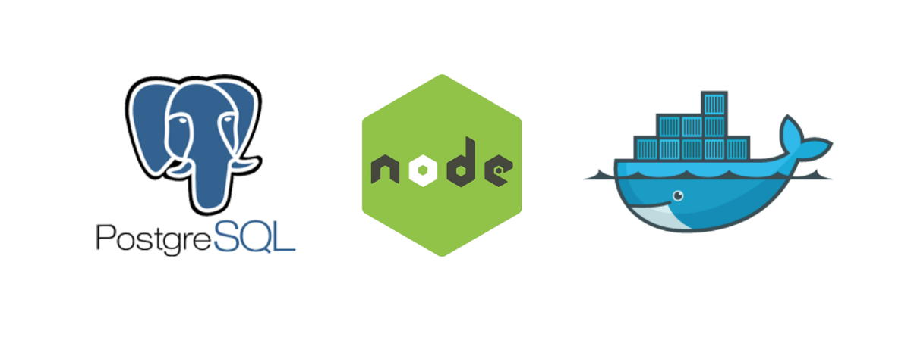

# RS School REST service



This application is a [Trello](https://trello.com/) competitor. It can be used for managing tasks and boards. Backend is written in [Typescript](https://www.typescriptlang.org/) and uses [Fastify](https://www.fastify.io/) framework to handle requests in [nodejs](https://nodejs.org/en/) server. It may be used on every type of OS because it works inside isolated [Docker](https://www.docker.com/) containers.

There is an opportunity to store data inside PostgreSQL database (🚧work in progress🚧).

## Prerequisites

- Git - [Download & Install Git](https://git-scm.com/downloads).
- Node.js - [Download & Install Node.js](https://nodejs.org/en/download/) and the npm package manager.

## Downloading

```
git clone https://github.com/OKitel/nodejs2021Q4-service.git
```

## Installing NPM modules

```
npm install
```

## Running application

```
npm start
```

After starting the app on port (4000 as default) you can open
in your browser OpenAPI documentation by typing http://localhost:4000/docs/.
For more information about OpenAPI/Swagger please visit https://swagger.io/.

## Testing

After application running open new terminal and enter:

To run all tests without authorization

```
npm test
```

To run only one of all test suites (users, boards or tasks)

```
npm test <suite name>
```

To run all test with authorization

```
npm run test:auth
```

To run only specific test suite with authorization (users, boards or tasks)

```
npm run test:auth <suite name>
```

## Development

If you're using VSCode, you can get a better developer experience from integration with [ESLint](https://marketplace.visualstudio.com/items?itemName=dbaeumer.vscode-eslint) and [Prettier](https://marketplace.visualstudio.com/items?itemName=esbenp.prettier-vscode) extensions.

### Auto-fix and format

```
npm run lint
```

### Debugging in VSCode

Press <kbd>F5</kbd> to debug.

For more information, visit: https://code.visualstudio.com/docs/editor/debugging

## Docker 🐳

This application is using docker compose file to declare and build images. Also it creates user defined network between containers.
To run the entire app use the next command in your terminal in the project root directory

```
docker compose up
```

This command will build containers with app and postgreSQL database. The size of app container is 270 MB.

When containers start, the application waits for the Postgres container to start first.

If you want to keep your terminal free of logs you may use the next command

```
docker compose up -d
```

To see logs from the container in the detached mode use

```
docker compose logs -f
```

If any error occures container will be automaticaly restarted.

Logs and data are stored outside containers (in volumes), that is why they will be saved even if you delete images from your PC and then rebuild it again.

Nodemon watches after changes inside _src_ directory and will rebuild containers.

There is no need to rebuild images after changes inside .env file.

To stop containers use

```
docker compose stop
```

To stop and delete containers use

```
docker compose down
```

To delete images from your PC use

```
docker image rm <image ID>
```

The image of this app is in private Docker Hub repository [okitel/rsschool-nodejs-service](https://hub.docker.com/repository/docker/okitel/rsschool-nodejs-service).

### Documentation

Typedoc is installed so you can generate documentation based on tsdoc. To do this, use the following script:

```
npm run docs
```
